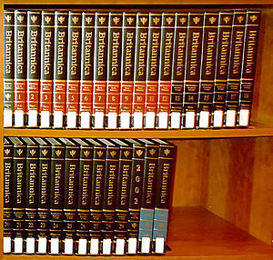
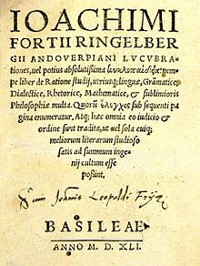

An&nbsp;<strong>encyclopedia</strong>&nbsp;or&nbsp;<strong>encyclopaedia</strong>&nbsp;(<a title="British English" href="https://en.wikipedia.org/wiki/British_English">British English</a>) is a&nbsp;<a title="Reference work" href="https://en.wikipedia.org/wiki/Reference_work">reference work</a>&nbsp;or&nbsp;<a title="Compendium" href="https://en.wikipedia.org/wiki/Compendium">compendium</a>&nbsp;providing summaries of&nbsp;<a title="" href="https://en.wikipedia.org/wiki/Knowledge">knowledge</a>&nbsp;either from all branches or from a particular field or discipline.&nbsp;Encyclopedias are divided into&nbsp;<a title="Article (publishing)" href="https://en.wikipedia.org/wiki/Article_(publishing)">articles</a>&nbsp;or entries that are often arranged&nbsp;<a title="Alphabetical order" href="https://en.wikipedia.org/wiki/Alphabetical_order">alphabetically</a>&nbsp;by article name&nbsp;and sometimes by thematic categories. Encyclopedia entries are longer and more detailed than those in most&nbsp;<a title="Dictionary" href="https://en.wikipedia.org/wiki/Dictionary">dictionaries</a>.&nbsp;Generally speaking, unlike dictionary entries&mdash;which focus on&nbsp;<a title="Linguistics" href="https://en.wikipedia.org/wiki/Linguistics">linguistic</a>&nbsp;information about&nbsp;<a title="Word" href="https://en.wikipedia.org/wiki/Word">words</a>, such as their&nbsp;<a title="Etymology" href="https://en.wikipedia.org/wiki/Etymology">etymology</a>, meaning, pronunciation, use, and grammatical forms&mdash;encyclopedia articles focus on&nbsp;<a title="Fact" href="https://en.wikipedia.org/wiki/Fact">factual</a>&nbsp;information concerning the subject named in the article's title.

Encyclopedias have existed for around 2,000 years and have evolved considerably during that time as regards to language (written in a major international or a vernacular language), size (few or many volumes), intent (presentation of a global or a limited range of knowledge), cultural perspective (authoritative, ideological, didactic, utilitarian), authorship (qualifications, style), readership (education level, background, interests, capabilities), and the technologies available for their production and distribution (hand-written manuscripts, small or large print runs, Internet). As a valued source of reliable information compiled by experts, printed versions found a prominent place in libraries, schools and other educational institutions.

The appearance of&nbsp;<a title="Online encyclopedia" href="https://en.wikipedia.org/wiki/Online_encyclopedia">digital and open-source versions</a>&nbsp;in the 21st century has vastly expanded the accessibility, authorship, readership, and variety of encyclopedia entries.

 

&nbsp;

The volumes of the 15th edition of&nbsp;<em><a title="Encyclop&aelig;dia Britannica" href="https://en.wikipedia.org/wiki/Encyclop%C3%A6dia_Britannica">Encyclop&aelig;dia Britannica</a></em>&nbsp;(plus the volume for the year 2002) span two bookshelves in a library.

&nbsp;

&nbsp;

Title page of&nbsp;<em>Lucubrationes</em>, 1541 edition, one of the first books to use a variant of the word&nbsp;<em>encyclopedia</em>&nbsp;in the title

&nbsp;

<h2> </h2>
<ul>

                             
 <li><a target="_blank" href="https://github.com/manjunath5496/Encyclopedia-Books/blob/master/ncy(1).pdf" style="text-decoration:none;">Pharmaceutical Manufacturing Encyclopedia</a></li>
 <li><a target="_blank" href="https://github.com/manjunath5496/Encyclopedia-Books/blob/master/ncy(2).pdf" style="text-decoration:none;">Encyclopedia of Soils in the Environment  </a></li>
                                <li><a target="_blank" href="https://github.com/manjunath5496/Encyclopedia-Books/blob/master/ncy(3).pdf" style="text-decoration:none;">Encyclopedia of Geomorphology</a></li>
 <li><a target="_blank" href="https://github.com/manjunath5496/Encyclopedia-Books/blob/master/ncy(4).pdf" style="text-decoration:none;">The Gale Encyclopedia of Surgery: A Guide for Patients and Caregivers</a></li>                              
<li><a target="_blank" href="https://github.com/manjunath5496/Encyclopedia-Books/blob/master/ncy(5).pdf" style="text-decoration:none;">Encyclopedia of Pest Management</a></li>
<li><a target="_blank" href="https://github.com/manjunath5496/Encyclopedia-Books/blob/master/ncy(6).pdf" style="text-decoration:none;">The Gale encyclopedia of psychology</a></li>
 
  <li><a target="_blank" href="https://github.com/manjunath5496/Encyclopedia-Books/blob/master/ncy(7).pdf" style="text-decoration:none;">The Gale Encyclopedia of Alternative Medicine</a></li>
 <li><a target="_blank" href="https://github.com/manjunath5496/Encyclopedia-Books/blob/master/ncy(8).pdf" style="text-decoration:none;">Encyclopedia of Sex and Gender </a></li>
   <li><a target="_blank" href="https://github.com/manjunath5496/Encyclopedia-Books/blob/master/ncy(9).pdf" style="text-decoration:none;">Biology, Vol. 4 (Pr-Z)</a></li>                             
 <li><a target="_blank" href="https://github.com/manjunath5496/Encyclopedia-Books/blob/master/ncy(10).pdf" style="text-decoration:none;">Encyclopedia of Religion </a></li>                              
<li><a target="_blank" href="https://github.com/manjunath5496/Encyclopedia-Books/blob/master/ncy(11).pdf" style="text-decoration:none;">Encyclopedia of Computer Science and Technology</a></li>
<li><a target="_blank" href="https://github.com/manjunath5496/Encyclopedia-Books/blob/master/ncy(12).pdf" style="text-decoration:none;">The Encyclopedia of World History</a></li>
               <li><a target="_blank" href="https://github.com/manjunath5496/Encyclopedia-Books/blob/master/ncy(13).pdf" style="text-decoration:none;">Encyclopedia of Human Body Systems</a></li>
 <li><a target="_blank" href="https://github.com/manjunath5496/Encyclopedia-Books/blob/master/ncy(14).pdf" style="text-decoration:none;">The Encyclopedia of Vampires, Werewolves, and Other Monsters </a></li>                              
<li><a target="_blank" href="https://github.com/manjunath5496/Encyclopedia-Books/blob/master/ncy(15).pdf" style="text-decoration:none;">The Gale Encyclopedia Of Cancer</a></li>
<li><a target="_blank" href="https://github.com/manjunath5496/Encyclopedia-Books/blob/master/ncy(16).pdf" style="text-decoration:none;">Encyclopedia of Mathematics </a></li>

  <li><a target="_blank" href="https://github.com/manjunath5496/Encyclopedia-Books/blob/master/ncy(17).pdf" style="text-decoration:none;">The Gale Encyclopedia of Neurological Disorders </a></li>                              
<li><a target="_blank" href="https://github.com/manjunath5496/Encyclopedia-Books/blob/master/ncy(18).pdf" style="text-decoration:none;">Encyclopedia of Biology </a></li>
<li><a target="_blank" href="https://github.com/manjunath5496/Encyclopedia-Books/blob/master/ncy(19).pdf" style="text-decoration:none;">The Encyclopedia of Farm Animal Nutrition </a></li>
 
<li><a target="_blank" href="https://github.com/manjunath5496/Encyclopedia-Books/blob/master/ncy(20).pdf" style="text-decoration:none;">The Natural Remedies Encyclopedia </a></li>

<li><a target="_blank" href="https://github.com/manjunath5496/Encyclopedia-Books/blob/master/ncy(21).pdf" style="text-decoration:none;">The Encyclopedia of Nutrition and Good Health </a></li>
 
  <li><a target="_blank" href="https://github.com/manjunath5496/Encyclopedia-Books/blob/master/ncy(22).pdf" style="text-decoration:none;">The Encyclopedia Of Drugs, Alcohol, And Addictive Behavior </a></li>                              
<li><a target="_blank" href="https://github.com/manjunath5496/Encyclopedia-Books/blob/master/ncy(24).rar" style="text-decoration:none;">The Ayurveda Encyclopedia </a></li>
<li><a target="_blank" href="https://github.com/manjunath5496/Encyclopedia-Books/blob/master/ncy(25).pdf" style="text-decoration:none;">The Gale Encyclopedia of Diets </a></li>
 
<li><a target="_blank" href="https://github.com/manjunath5496/Encyclopedia-Books/blob/master/ncy(26).rar" style="text-decoration:none;">Encyclopedia of Forensic Sciences</a></li>

<li><a target="_blank" href="https://github.com/manjunath5496/Encyclopedia-Books/blob/master/ncy(27).pdf" style="text-decoration:none;">Encyclopedia of Molecular Mechanisms of Disease </a></li>
  
 
  <li><a target="_blank" href="https://github.com/manjunath5496/Encyclopedia-Books/blob/master/ncy(23).pdf" style="text-decoration:none;">Encyclopedia of Islam </a></li>                              
<li><a target="_blank" href="https://github.com/manjunath5496/Encyclopedia-Books/blob/master/ncy(28).pdf" style="text-decoration:none;">Encyclopedia of Government and Politics </a></li>
<li><a target="_blank" href="https://github.com/manjunath5496/Encyclopedia-Books/blob/master/ncy(29).pdf" style="text-decoration:none;">Encyclopedia of Hinduism </a></li>
 
<li><a target="_blank" href="https://github.com/manjunath5496/Encyclopedia-Books/blob/master/ncy(30).pdf" style="text-decoration:none;">Encyclopedia of Sociology </a></li>

<li><a target="_blank" href="https://github.com/manjunath5496/Encyclopedia-Books/blob/master/ncy(31).pdf" style="text-decoration:none;">The Cambridge Encyclopedia of Child Development </a></li>
 
  <li><a target="_blank" href="https://github.com/manjunath5496/Encyclopedia-Books/blob/master/ncy(33).pdf" style="text-decoration:none;">The Illustrated Encyclopedia of Hinduism </a></li>                              
<li><a target="_blank" href="https://github.com/manjunath5496/Encyclopedia-Books/blob/master/ncy(35).pdf" style="text-decoration:none;">The Illustrated Encyclopedia of Body-Mind Disciplines </a></li>
<li><a target="_blank" href="https://github.com/manjunath5496/Encyclopedia-Books/blob/master/ncy(36).pdf" style="text-decoration:none;">The Encyclopedia of Natural Medicine </a></li>
 
<li><a target="_blank" href="https://github.com/manjunath5496/Encyclopedia-Books/blob/master/ncy(37).pdf" style="text-decoration:none;"> Encyclopedia of Space and Astronomy</a></li>

  <li><a target="_blank" href="https://github.com/manjunath5496/Encyclopedia-Books/blob/master/ncy(32).pdf" style="text-decoration:none;">Encyclopedia of Homeopathy </a></li>                              
<li><a target="_blank" href="https://github.com/manjunath5496/Encyclopedia-Books/blob/master/ncy(34).pdf" style="text-decoration:none;">Encyclopedia of Occultism and Parapsychology </a></li>
<li><a target="_blank" href="https://github.com/manjunath5496/Encyclopedia-Books/blob/master/ncy(38).pdf" style="text-decoration:none;">The Encyclopedia of Ancient Natural Scientists </a></li>
 
<li><a target="_blank" href="https://github.com/manjunath5496/Encyclopedia-Books/blob/master/ncy(39).pdf" style="text-decoration:none;"> Human Body Encyclopedia</a></li>

  
<li><a target="_blank" href="https://github.com/manjunath5496/Encyclopedia-Books/blob/master/ncy(40).pdf" style="text-decoration:none;"> Encyclopedia of Chemistry</a></li>

  <li><a target="_blank" href="https://github.com/manjunath5496/Encyclopedia-Books/blob/master/ncy(41).pdf" style="text-decoration:none;">Encyclopedia of Electronic Circuits </a></li>                              
<li><a target="_blank" href="https://github.com/manjunath5496/Encyclopedia-Books/blob/master/ncy(42).pdf" style="text-decoration:none;">Encyclopedia of Nursing Research </a></li>
<li><a target="_blank" href="https://github.com/manjunath5496/Encyclopedia-Books/blob/master/ncy(43).pdf" style="text-decoration:none;">Encyclopedia of Geography Terms, Themes, and Concepts </a></li>
 
<li><a target="_blank" href="https://github.com/manjunath5496/Encyclopedia-Books/blob/master/ncy(44).pdf" style="text-decoration:none;"> Encyclopedia of Communication Theory</a></li>
 
   <li><a target="_blank" href="https://github.com/manjunath5496/Encyclopedia-Books/blob/master/ncy(45).pdf" style="text-decoration:none;">Encyclopedia of Psychology and Law </a></li>                              
<li><a target="_blank" href="https://github.com/manjunath5496/Encyclopedia-Books/blob/master/ncy(46).pdf" style="text-decoration:none;">Leung's Encyclopedia of Common Natural Ingredients: Used in Food, Drugs and Cosmetics </a></li>
<li><a target="_blank" href="https://github.com/manjunath5496/Encyclopedia-Books/blob/master/ncy(47).pdf" style="text-decoration:none;">The Encyclopedia of Conspiracies and Conspiracy Theories </a></li>
 
<li><a target="_blank" href="https://github.com/manjunath5496/Encyclopedia-Books/blob/master/ncy(48).pdf" style="text-decoration:none;"> Extraordinary Animals: An Encyclopedia of Curious and Unusual Animals</a></li>
 
 
   <li><a target="_blank" href="https://github.com/manjunath5496/Encyclopedia-Books/blob/master/ncy(49).pdf" style="text-decoration:none;">The Philosophy of Science: An Encyclopedia</a></li>                              
<li><a target="_blank" href="https://github.com/manjunath5496/Encyclopedia-Books/blob/master/ncy(50).pdf" style="text-decoration:none;">The Canadian Encyclopedia Of Natural Medicine </a></li>
<li><a target="_blank" href="https://github.com/manjunath5496/Encyclopedia-Books/blob/master/ncy(51).pdf" style="text-decoration:none;">The Internet Encyclopedia </a></li>
 

 
 
 
 
 
 
 
 
 
  </ul>
